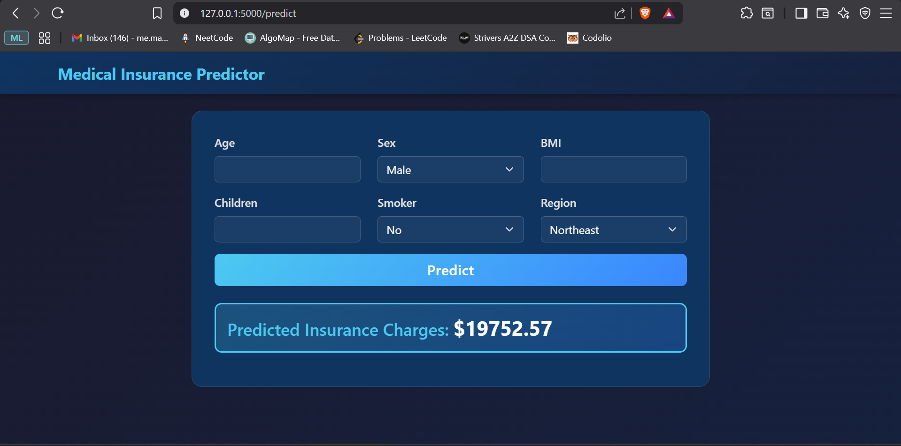

# 💰 Medical Insurance Predictor

A modern machine learning web application built with **Python** and **Flask** to predict medical insurance charges based on personal health metrics and demographic information.

📸 **Working Prototype**
---


---

## 🚀 Features

- **Accurate Predictions**: Machine learning model trained on real insurance dataset with advanced feature engineering
- **Responsive Design**: Fully mobile-friendly interface that works seamlessly across all devices
- **Real-time Results**: Instant predictions displayed in an elegant, animated card format
- **Dual Interface Support**: Web form for users and JSON API for programmatic access
- **Comprehensive Testing**: Full test suite with pytest ensuring reliability

---

## 🧠 Concepts Used

### 1. Machine Learning

- **Dataset**: The model was trained on the **Medical Cost Personal Dataset**, containing insurance charges for 1,338 individuals with various health and demographic attributes.
- **Model**: A **Linear Regression** model was used with advanced feature engineering to capture non-linear relationships in the data. The training process is documented in the `notebooks/model.ipynb` notebook.
- **Feature Engineering**: Critical step that dramatically improved model accuracy:
  - **Interaction Features**: `BMI × Age`, `Smoker × BMI` to capture combined effects
  - **Polynomial Features**: `Age²`, `BMI²` to model non-linear relationships
  - **One-Hot Encoding**: Categorical variables (sex, region, smoker) converted to binary features
- **Data Preprocessing**: Features are scaled using `StandardScaler` to normalize the input range, ensuring optimal model performance.
- **Prediction**: The trained model (`insurance_model.pkl`) infers insurance charges from the 6 user-provided features, plus 6 engineered features.

### 2. Flask (Python Web Framework)

- **`app/__init__.py`**: Initializes the Flask application factory pattern for clean architecture.
- **Blueprint Architecture**: Routes are organized using Flask Blueprints for modularity and maintainability.
- **Model Loading**: Uses `joblib` library to load pre-trained `.pkl` files (model, scaler, feature names) once at startup for fast predictions.
- **Dual Response Format**: Automatically detects request type and returns HTML for form submissions or JSON for API calls.
- **Error Handling**: Graceful error messages displayed to users when invalid input is provided.

### 3. Modern Frontend

- **Bootstrap 5**: Latest version with native dark mode support via `data-bs-theme="dark"`.
- **Custom CSS**: Gradient backgrounds, glassmorphism effects, and smooth animations for a premium feel.
- **Responsive Grid**: Mobile-first design with Bootstrap's grid system for perfect layout on any screen size.

---

## 🛠️ File Structure

```bash
Insurance-app/
├── app/
│   ├── __init__.py               # Flask application factory
│   ├── routes.py                 # Route definitions and request handling
│   ├── services/
│   │   └── inference.py          # ML model inference logic
│   ├── templates/
│   │   ├── base.html             # Base template with navbar and Bootstrap
│   │   └── index.html            # Main form and results display
│   └── static/
│       ├── css/
│       │   └── styles.css        # Custom dark mode styling
│       ├── js/
│       │   └── main.js           # Optional AJAX functionality
│       └── screenshot.png        # Working screenshot
├── models/
│   ├── insurance_model.pkl       # Trained Linear Regression model
│   ├── scaler.pkl                # StandardScaler for feature normalization
│   └── feature_names.pkl         # Feature order for prediction
├── notebooks/
│   └── model.ipynb               # Model training and evaluation
├── tests/
│   ├── test_inference.py         # Unit tests for ML inference
│   └── test_routes.py            # Unit tests for Flask routes
├── .gitignore                    # Git ignore file
├── config.py                     # Application configuration
├── run.py                        # Application entry point
├── requirements.txt              # Python dependencies
├── insurance.csv                 # Training dataset
├── Procfile                      # Deployment: Tells platform how to start app
├── runtime.txt                   # Deployment: Specifies Python version
├── render.yaml                   # Deployment: Render platform configuration
└── README.md                     # Project documentation
```

### 📋 Deployment Files Explained

| File | Purpose | Required? |
|------|---------|-----------|
| **Procfile** | Tells hosting platform how to start the app (`gunicorn run:app`) | ✅ Yes |
| **runtime.txt** | Specifies Python version (ensures consistency) | ⚠️ Recommended |
| **render.yaml** | Auto-configures Render deployment settings | ⚠️ Optional (makes deployment easier) |
| **DEPLOYMENT.md** | Step-by-step deployment instructions | 📖 Guide only |

---

## 💻 How to Run Locally

### ✅ Prerequisites

- Python 3.11+
- `pip` package manager

### 📦 Setup Instructions

1.  **Clone the repository:**
    ```bash
    git clone https://github.com/<your-username>/Insurance-app.git
    cd Insurance-app
    ```

2.  **Create and activate a virtual environment (recommended):**
    ```bash
    # Create the environment
    python -m venv venv
    
    # Activate it
    # On Windows PowerShell:
    .\venv\Scripts\Activate.ps1
    
    # On Linux/Mac:
    source venv/bin/activate
    ```

3.  **Install the required libraries:**
    ```bash
    pip install -r requirements.txt
    ```

### ▶️ Run the App

1.  Make sure you are in the main project directory in your terminal.
2.  Run the following command:
    ```bash
    python run.py
    ```
3.  The application will start on `http://127.0.0.1:5000`
4.  Open this URL in your web browser to access the application.

### 🧪 Run Tests

```bash
# Set PYTHONPATH and run tests
$env:PYTHONPATH = "C:\path\to\Insurance-app"  # Windows PowerShell
export PYTHONPATH=/path/to/Insurance-app      # Linux/Mac

pytest -v
```

### 🚀 Deploy to Render 

**Quick Deploy:**
1. Push your code to GitHub
2. Sign up at [Render.com](https://render.com)
3. Create new Web Service
4. Connect your GitHub repository
5. Deploy with one click!

---

## 📥 Input Features

The model requires the following 6 features to make a prediction:

| Feature                      | Description                                    | Type    | Example |
| ---------------------------- | ---------------------------------------------- | ------- | ------- |
| **Age**                      | Age of the person (in years)                   | Numeric | 30      |
| **Sex**                      | Gender of the person                           | Select  | Male/Female |
| **BMI**                      | Body Mass Index (weight/height²)               | Numeric | 25.5    |
| **Children**                 | Number of dependents covered by insurance      | Numeric | 2       |
| **Smoker**                   | Smoking status of the person                   | Select  | Yes/No  |
| **Region**                   | Residential area in the US                     | Select  | Northeast/Northwest/Southeast/Southwest |

---

## 📤 Output

- **Predicted Insurance Charges**: Dollar amount prediction for annual medical insurance cost
- **Format**: Displayed as `$X,XXX.XX` with two decimal precision
- **Display**: Beautiful animated card with cyan accent color on dark background

---

## 🔌 API Usage

### Prediction Endpoint

**POST** `/predict`

**Request (JSON):**
```json
{
  "age": 30,
  "sex": "male",
  "bmi": 25.0,
  "children": 2,
  "smoker": "no",
  "region": "northeast"
}
```

**Response (JSON):**
```json
{
  "predicted_charges": 4500.25
}
```

**Error Response:**
```json
{
  "error": "Error message description"
}
```

**Request (Form Data):**
```bash
curl -X POST http://127.0.0.1:5000/predict \
  -d "age=30" \
  -d "sex=male" \
  -d "bmi=25.0" \
  -d "children=2" \
  -d "smoker=no" \
  -d "region=northeast"
```

**Response:** HTML page with prediction result

---

## 🔍 Model Performance

- **Algorithm**: Linear Regression with Feature Engineering
- **Features Used**: 12 total (6 input + 6 engineered)
- **Engineered Features**:
  - `BMI × Age`: Captures age-related health complications
  - `Smoker × BMI`: Models smoking impact on overweight individuals
  - `Age²`: Non-linear age effects
  - `BMI²`: Non-linear BMI effects
- **Preprocessing**: StandardScaler normalization
- **Encoding**: One-hot encoding for categorical variables

---

## 🎨 UI/UX Highlights

- **Dark Theme**: Gradient background (#1a1a2e to #16213e)
- **Glassmorphism**: Semi-transparent cards with backdrop blur
- **Animations**: Smooth slide-in effects for results display
- **Color Scheme**: Cyan (#4cc9f0) and blue (#3a86ff) accents
- **Typography**: Clean, modern Segoe UI font stack
- **Hover Effects**: Button lift and glow on interaction

---

## 🛠️ Development

### Adding New Features

1. Update the model in `notebooks/model.ipynb`
2. Retrain and export new model files to `models/`
3. Update `inference.py` if feature engineering logic changes
4. Add corresponding unit tests in `tests/`
5. Run test suite to ensure nothing breaks

### Running in Debug Mode

```bash
# Windows PowerShell
$env:FLASK_ENV="development"
python run.py

# Linux/Mac
export FLASK_ENV=development
python run.py
```

### Project Architecture

- **Factory Pattern**: Clean Flask app initialization
- **Blueprint Pattern**: Modular route organization
- **Service Layer**: Business logic separated from routes
- **Testing**: Comprehensive unit tests for all components

---

## 📊 Dataset Information

- **Source**: Medical Cost Personal Dataset
- **Size**: 1,338 records
- **Features**: Age, Sex, BMI, Children, Smoker, Region
- **Target**: Insurance charges (continuous variable)
- **Preprocessing**: Handled missing values, normalized features

---

## 🙌 Credits

- **Dataset**: [Medical Cost Personal Datasets](https://www.kaggle.com/datasets/mirichoi0218/insurance/data) from Kaggle.
- **Developed by**: [Manav Goel](https://github.com/Manav0411)

---

## 📝 License

This project is open source and available for educational purposes.
